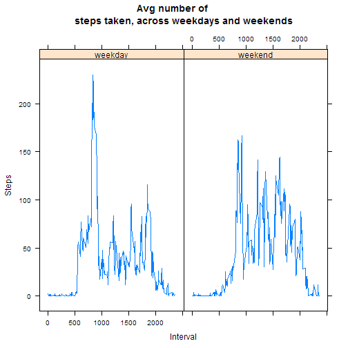

## Loading and preprocessing the data
The working directory was set, and the datafile was unzipped. The data was 
loaded into R and stored as a data table using the data.table package.


```r
setwd("F:/Data_Science_Coursera/Reproducible_Research/RepData_PeerAssessment1")
unzip("activity.zip", exdir = ".")
```

```
## Warning in unzip("activity.zip", exdir = "."): error 1 in extracting from
## zip file
```

```r
options(scipen=999)

library(lattice)
library(ggplot2)
library(data.table)

act <- data.table(read.csv("activity.csv"))
print(act)
```

```
##        steps       date interval
##     1:    NA 2012-10-01        0
##     2:    NA 2012-10-01        5
##     3:    NA 2012-10-01       10
##     4:    NA 2012-10-01       15
##     5:    NA 2012-10-01       20
##    ---                          
## 17564:    NA 2012-11-30     2335
## 17565:    NA 2012-11-30     2340
## 17566:    NA 2012-11-30     2345
## 17567:    NA 2012-11-30     2350
## 17568:    NA 2012-11-30     2355
```

## What is mean total number of steps taken per day?

### 1. Histogram of the total number of steps taken each day


```r
setkey(act, "date")
totSteps <- act[, sum(steps, na.rm = TRUE), by = date]

hist(totSteps$V1, main = "Total number of steps taken each day", xlab = "Steps")
```

 

### 2. **Mean** and **median** total number of steps taken each day


```r
meanTotSteps <- mean(totSteps$V1)
medTotSteps <- median(totSteps$V1)
```

The mean total number of steps taken each day is **9354.23**,
and the median total number of steps taken each day is **10395**.


## What is the average daily activity pattern?

### 1. Time series plot of the 5-minute interval and the average number of steps taken, averaged across all days


```r
setkey(act, "interval")
stepsbyInt <- act[, mean(steps, na.rm = TRUE), by = interval]
plot(stepsbyInt, type = "l", xlab = "Interval", ylab = "Steps", main = 
             "Avg steps taken each day (across all days) by 5-minute interval")
```

 

### 2. The 5-minute interval containing the maximum number of steps:


```r
stepsbyInt[which(V1 == max(V1))]
```

```
##    interval       V1
## 1:      835 206.1698
```

```r
max <- stepsbyInt[which(V1 == max(V1))]$interval
plot(stepsbyInt, type = "l", xlab = "Interval", ylab = "Steps", main = 
             "Avg steps taken each day (across all days) by 5-minute interval")
abline(v = max, col = "red")
```

 

The maximum average number of steps taken across all days occurred at
the 835-minute interval.


## Imputing missing values

### 1. Total number of missing values in the dataset


```r
nrow(act[which(is.na(steps)==TRUE)])
```

```
## [1] 2304
```

### 2. Missing values will be replaced with the mean number of steps for that 5-minute interval.

### 3. New dataset prepared with values filled in as described above.


```r
act2 <- act

act2$steps <- as.numeric(act2$steps)
act2 <- merge(act2, stepsbyInt, by = "interval")

act2[which(is.na(steps) == TRUE)]$steps <- act2[which(is.na(steps) == TRUE)]$V1
act2$V1 <- NULL
act2
```

```
##        interval     steps       date
##     1:        0  1.716981 2012-10-01
##     2:        0  0.000000 2012-10-02
##     3:        0  0.000000 2012-10-03
##     4:        0 47.000000 2012-10-04
##     5:        0  0.000000 2012-10-05
##    ---                              
## 17564:     2355  0.000000 2012-11-26
## 17565:     2355  0.000000 2012-11-27
## 17566:     2355  0.000000 2012-11-28
## 17567:     2355  0.000000 2012-11-29
## 17568:     2355  1.075472 2012-11-30
```

### 4. Histogram of the total number of steps taken each day and **mean** and **median** total number of steps taken each day using the new dataset.


```r
totSteps2 <- act2[, sum(steps, na.rm = TRUE), by = date]
hist(totSteps2$V1, main = "Total number of steps taken each day (with missing 
     vals imputed)", xlab = "Steps")
```

 

```r
meanTotSteps2 <- mean(totSteps2$V1)
medTotSteps2 <- median(totSteps2$V1)
```

After imputing missing values, the mean total number of steps taken each day is **10766.19**, and the median total number of steps taken each day is **10766.19**.

The new estimates on the total number of steps taken each day are higher than 
the original estimates which ignored missing values. Imputing values seems to 
have raised these estimates, while bringing them closer to the center of the 
distribution. The new distribution is also more symmetric.

## Are there differences in activity patterns between weekdays and weekends?

### 1. A new factor variable was created with two levels: "weekday" and "weekend", corresponding to a given date


```r
act2$day <- weekdays(as.POSIXlt(act$date))
wkday <- c("Monday", "Tuesday", "Wednesday", "Thursday", "Friday")
wkend <- c("Saturday", "Sunday")

act2[day%in%wkday]$day <- "weekday"
act2[day%in%wkend]$day <- "weekend"

act2$day <- as.factor(act2$day)
act2
```

```
##        interval     steps       date     day
##     1:        0  1.716981 2012-10-01 weekday
##     2:        0  0.000000 2012-10-02 weekday
##     3:        0  0.000000 2012-10-03 weekday
##     4:        0 47.000000 2012-10-04 weekday
##     5:        0  0.000000 2012-10-05 weekday
##    ---                                      
## 17564:     2355  0.000000 2012-11-26 weekday
## 17565:     2355  0.000000 2012-11-27 weekday
## 17566:     2355  0.000000 2012-11-28 weekday
## 17567:     2355  0.000000 2012-11-29 weekday
## 17568:     2355  1.075472 2012-11-30 weekday
```

### 2. Panel plot containing a time series plot of the 5-minute interval and the average number of steps taken, averaged across (1)all weekdays and (2)all weekends


```r
wkdayMean <- act2[which(day=="weekday"), mean(steps), by = "interval"]
wkendMean <- act2[which(day=="weekend"), mean(steps), by = "interval"]
wkdayTable <- merge(act2[which(day=="weekday")], wkdayMean, by = "interval")
wkendTable <- merge(act2[which(day=="weekend")], wkendMean, by = "interval")
act3 <- rbind(wkdayTable, wkendTable)
act3
```

```
##        interval     steps       date     day       V1
##     1:        0  1.716981 2012-10-01 weekday 2.251153
##     2:        0  0.000000 2012-10-02 weekday 2.251153
##     3:        0  0.000000 2012-10-03 weekday 2.251153
##     4:        0 47.000000 2012-10-04 weekday 2.251153
##     5:        0  0.000000 2012-10-05 weekday 2.251153
##    ---                                               
## 17564:     2355  0.000000 2012-11-11 weekend 0.134434
## 17565:     2355  0.000000 2012-11-17 weekend 0.134434
## 17566:     2355  0.000000 2012-11-18 weekend 0.134434
## 17567:     2355  0.000000 2012-11-24 weekend 0.134434
## 17568:     2355  0.000000 2012-11-25 weekend 0.134434
```

```r
xyplot(V1 ~ interval | day, data = act3, type = "l", main = "Avg number of 
       steps taken, across weekdays and weekends", xlab = "Interval", 
       ylab = "Steps")
```

 

The max average number of steps per day seems to occur at the same interval for both weekdays and weekends, but the overall total number of steps taken seems to be lower for weekends than weekdays.
